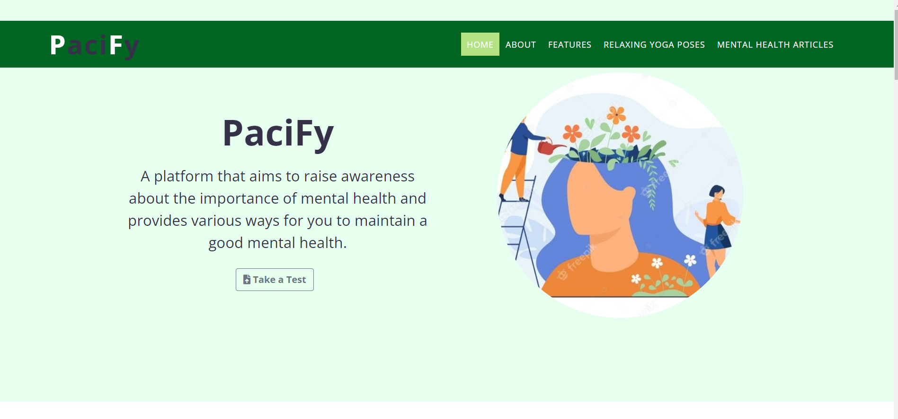
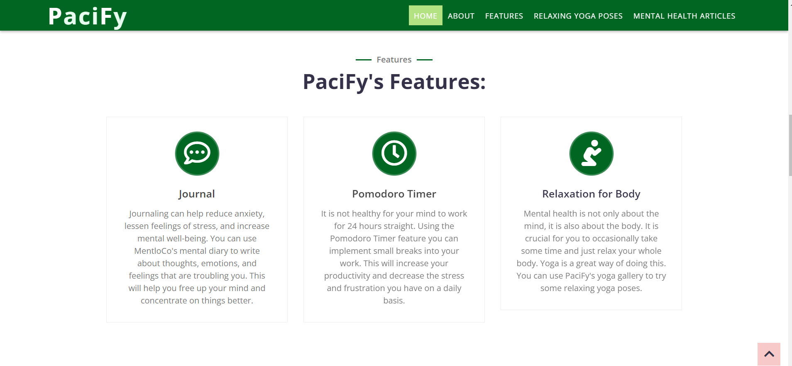
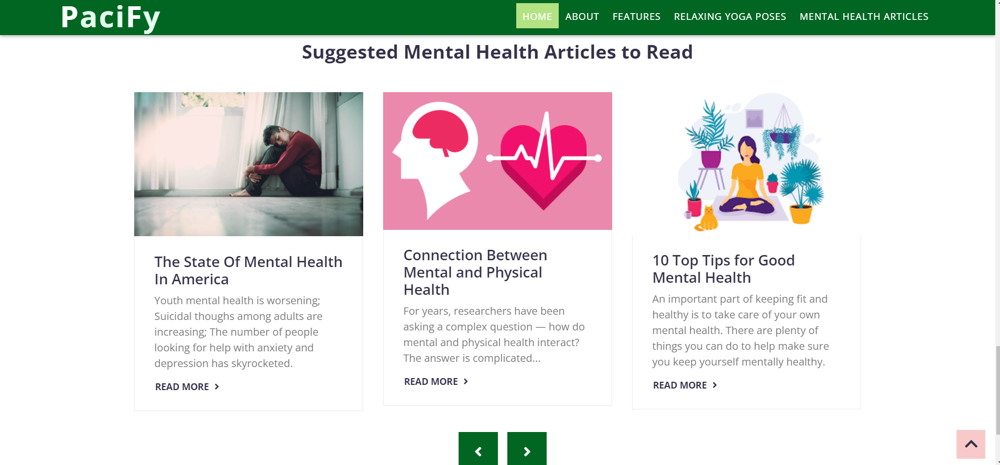
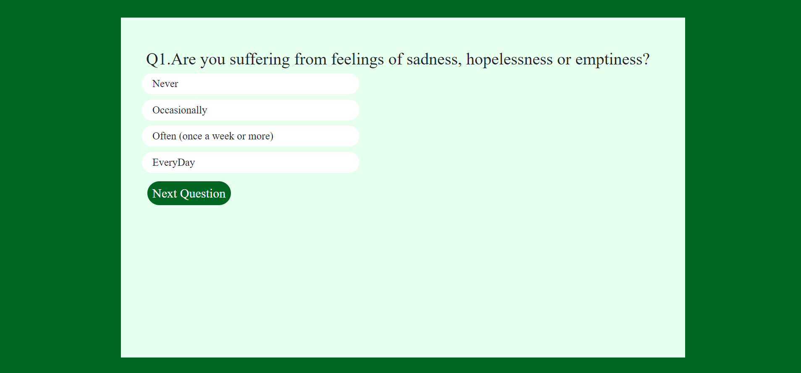

# Pacify - A mental health awareness website

## Inspiration

Mental health refers to a person's psychological, emotional, and social well-being; it influences what they feel and how they think, and behave.
An emotionally fit and stable person always feels vibrant and truly alive and can easily manage emotionally difficult situations. But in today's times,
mental sickness is becoming a growing issue..According to research conducted on adults, mental illness affects 19% of the adult population. Nearly one 
in every five children and adolescents on the globe has a mental illness. These alarming statistics reflect the wider prevalence of mental ill-health.
This makes poor mental health a global problem needed to be solve as soon as possible.

## Project Description

Pacify provides some instant and effective solution to this problem. Using this will help one to develop good mental habits and develop a positive and 
healthy mindset.
Pacify provides various features:

- **_Quiz_:** The quiz section helps you discover about the mental health problems you are currently dealing with by asking some questions regarding your daily 
behaviour, actions and feelings.

- **_Journal_:** Journaling can help reduce anxiety, lessen feelings of stress, and increase an individual's mental well-being. You can use the journal to write 
down your thoughts, feelings and emotions as it can free up your mind and re-install calmness.

- **_Pomodoro Timer_:** In the pandemic, work level has greatly increased and a lot of people sit in front of their computers for prolonged periods of time. It 
is not healthy for your mind to work for long periods of time without a break. Using the Pomodoro Timer feature you can implement small breaks into your work.

- **_Yoga Gallery_:** Mental health is not only about the mind, it is also about the body. It is crucial for you to occasionally take some time and just relax your whole body. Yoga is a great way of doing this. You can search and sort through the gallery to find the type of yoga and poses that you like the best.

**_Articles_:** You can read about some useful and informative information.

## Tech Stack 

## What you can contribute
- Documentation
- Any new feature 
- Add sign-up form
- Chat-bot
- Add backend
- Many more relevant features on acceptance

## License

## Project Images

**_Home Page_:**

**_Features_:**

**_Articles_:**

**_Quiz_:**

## Project Maintainers

<table>
  <tbody><tr>
     <td align="center"><a href="https://github.com/mp3730"> <b> Mansi Prajapati </b></a> </td> </a></td>
     <td align="center"><a href="https://github.com/srai0109"> <b> Shikha Rai </b></a> </td> </a></td>
     <td align="center"><a href="https://github.com/vartika0605"> <b> Vartika Gupta </b></a> </td> </a></td>
     <td align="center"><a href="https://github.com/Tvisha07"> <b> Tvisha Srivastava </b></a> </td> </a></td>
  </tr>
</tbody></table>

